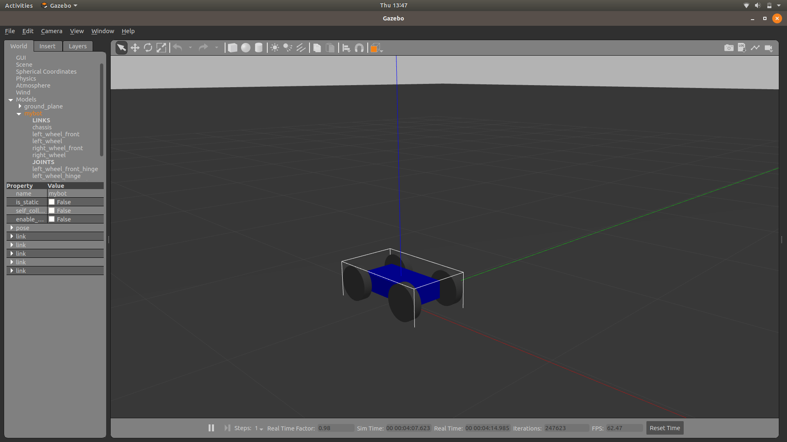

## Basic Robot
1. These file contain the code for the base robot , without sensors!



## To run the file

1. First clone the repo in your workspace(catkin_ws)

2. Checkout the base branch using:
 
```
git checkout base
```
3. Then build the packages , using catkin_make

4. Then launch the file 

```
roslaunch fb_gazebo fb.launch
```